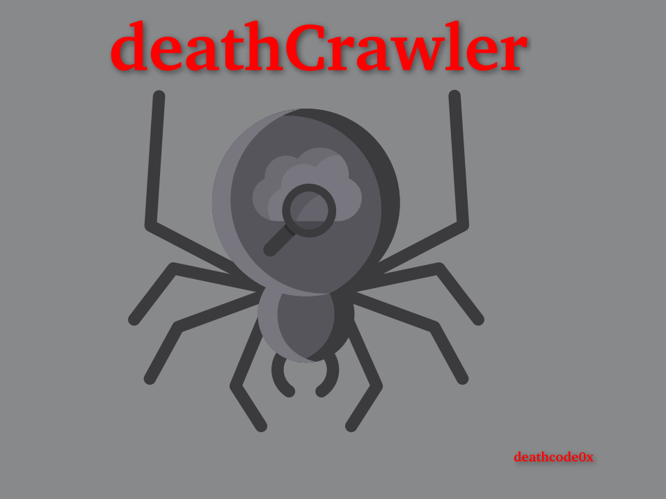
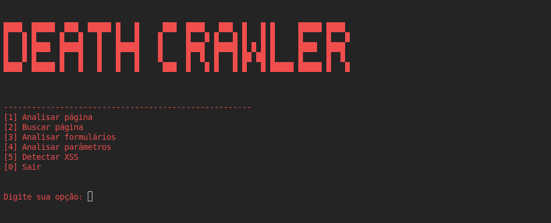

# DeathCrawler

> Ferramenta de análise e reconhecimento de aplicações web desenvolvida em Python, com foco em estudos de segurança da informação.

<!-- ===================================================== -->
<!-- GIF PRINCIPAL: coloque seu GIF em assets/demo.gif -->
<!-- ===================================================== -->

<p align="center">
  
</p>

---

## 🕷️ Sobre o projeto

O **DeathCrawler** é um projeto educacional desenvolvido em Python para estudar técnicas de **Web Scraping, reconhecimento e análise de aplicações web** em ambientes autorizados.

A ferramenta possui um menu interativo para executar diferentes módulos de análise.

## 🖥️ Interface

<p align="center">
  
</p>

## ⚙️ Funcionalidades

- Analisar página
- Buscar páginas
- Analisar formulários
- Analisar parâmetros
- Detectar possíveis pontos de entrada para XSS
- Navegação por menu no terminal
- Geração de resultados para análise

## 📁 Estrutura do projeto

```text
DeathCrawler/
├── scraper.py
├── parser.py
├── analyzer.py
├── xss_detector.py
├── parameter_analyzer.py
├── form_analyzer.py
├── reporter.py
├── data/
│   └── results.json
├── reports/
├── tests/
├── requirements.txt
└── README.md
```

## 🚀 Instalação

Clone o repositório:

```bash
git clone SEU_REPOSITORIO
cd DeathCrawler
```

Crie um ambiente virtual:

```bash
python3 -m venv venv
source venv/bin/activate
```

Instale as dependências:

```bash
pip install -r requirements.txt
```

## ▶️ Uso

Execute o programa:

```bash
python3 deathCrawler.py
```

O menu permite selecionar o tipo de análise:

```text
[1] Analisar página
[2] Buscar página
[3] Analisar formulários
[4] Analisar parâmetros
[5] Detectar XSS
[0] Sair
```

## 🎯 Objetivo

O projeto foi criado para prática de:

- Python
- Web Scraping
- HTTP
- HTML
- Análise de formulários
- Análise de parâmetros
- Fundamentos de segurança web
- Automação de tarefas de reconhecimento

## ⚠️ Uso autorizado

Utilize a ferramenta somente em sistemas, aplicações, laboratórios e redes para os quais você tenha autorização para realizar testes.

Este projeto possui finalidade educacional e de pesquisa em segurança.

## 👨‍💻 Desenvolvimento

Projeto desenvolvido para estudos práticos em **Python e Segurança da Informação**.

---

<p align="center">
  <b>DeathCrawler</b> • Python • Web Security
</p>
